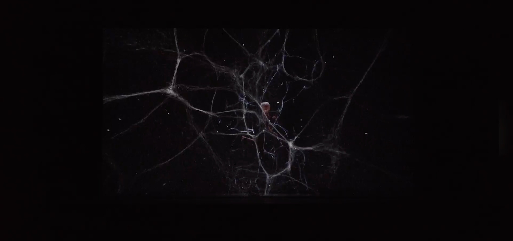

# Quiz8

## Part1 
I would want to discuss the "audio visualization" technology, particularly the dynamic image creation using sound frequency. This approach can translate auditory information into visual effects, hence simplifying user-musical interaction. Users' absorption and involvement can be raised by matching the rhythm and tone of sound to graphic aspects including form, color, and motion. This technology completely uses the emotional expression of music and generates interesting interactive experiences, hence it is quite appropriate for my project.

#### Sample image

## Part2 
I choose the audio acquisition and analysis function in p5. js,It generates dynamic patterns by use of animation routines and converts the frequency and loudness of sound into various values using real-time audio analysis. Graphics' size, form, and motion are driven by audio input, which also lets every sound create original visual effects. Closely related to audio signals, visual effects improve the emotional expression and visual attractiveness of music by means of immersive interactive experiences.

#### Sample image
